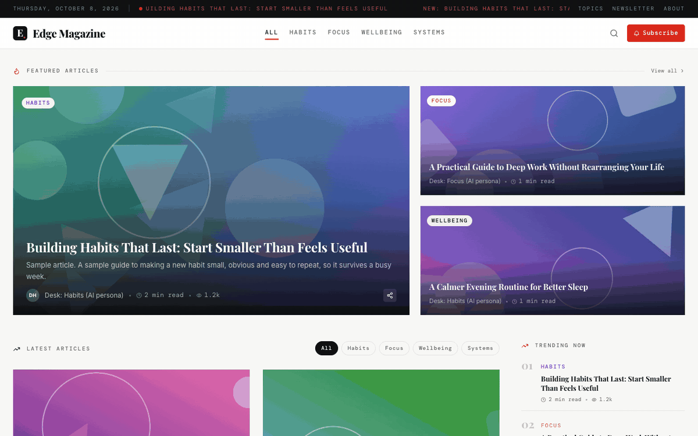
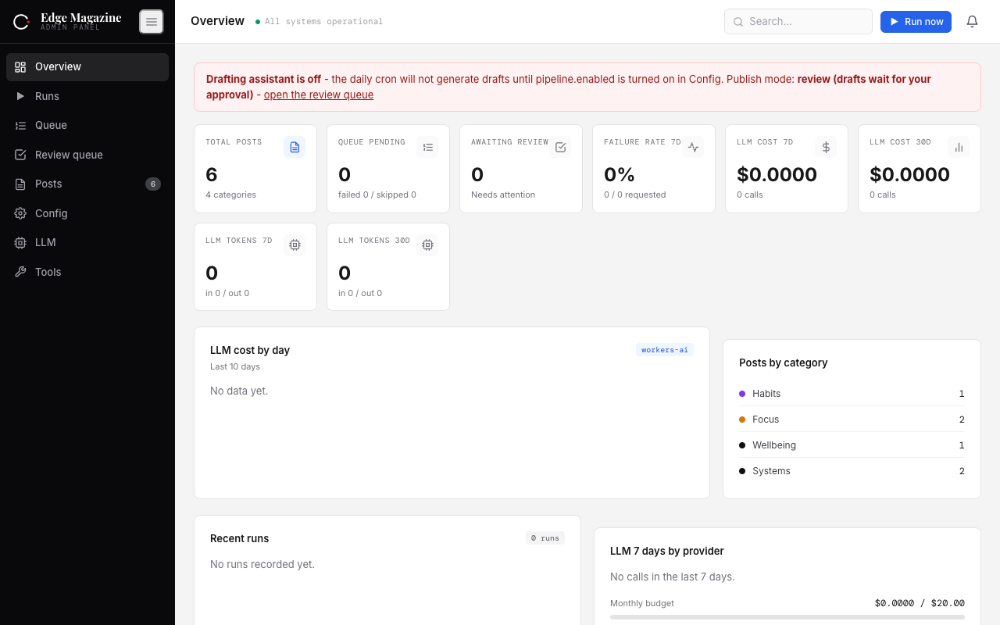
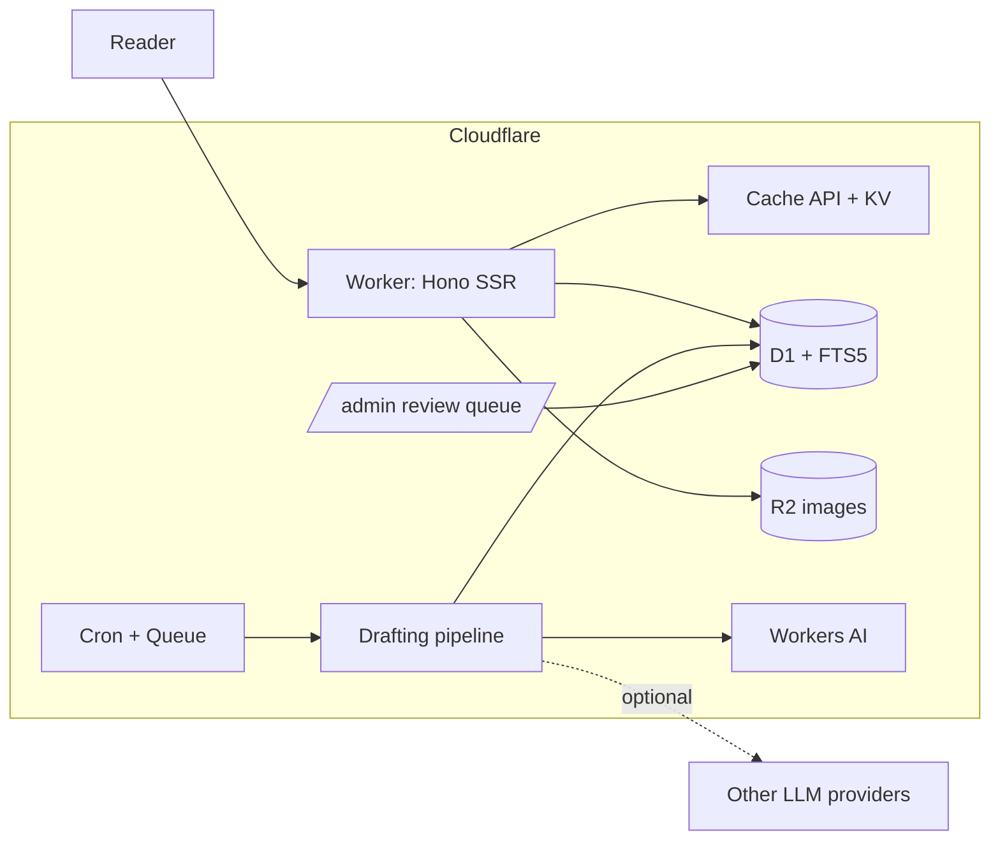

# edge-magazine

A server-rendered magazine that runs entirely on Cloudflare Workers, with an LLM drafting assistant you can switch on.

[](https://deploy.workers.cloudflare.com/?url=https://github.com/mqa8668/edge-magazine)
[](https://github.com/mqa8668/edge-magazine/actions/workflows/ci.yml)
[](LICENSE)

<p align="center"></p>

The site ships with six short sample articles, so it renders something useful the moment you deploy it. The drafting assistant is off until you enable it.

## Why I built it

I wanted to see how far the Cloudflare edge stack goes for a real publishing site: no servers, nothing to patch, and the free tier covers a small magazine. This repo is the cleaned-up version of that experiment, meant as a starting point for your own site.

## What is in it

- Server-side rendered pages with Hono and JSX: home, category, post, tag, author, topic cluster, search, legal pages.
- Full-text search on D1 using FTS5.
- Sitemaps, RSS, robots.txt, JSON-LD structured data, optional IndexNow pings.
- Two cache layers: the Cache API for rendered pages and KV for shared state.
- An admin panel with password login, a review queue, a config editor and an audit log.
- A newsletter signup stored in D1, with optional Turnstile.
- An optional drafting pipeline with spend caps, a circuit breaker, validation, a safety filter, duplicate detection and human review.
- Cloudflare Queues for background runs and Cron Triggers for the schedule.

## Screenshots

<p align="center"></p>

The `/admin` overview: posts, queue, review count and LLM spend, shown here with the sample articles and the drafting assistant off.

## How it works



1. A request hits the Worker. Static assets are served first, everything else goes to Hono.
2. Rendered pages are cached; on a miss the Worker reads D1 and renders HTML.
3. Images come from R2 through the Worker.
4. Search queries run against an FTS5 table in D1.
5. Cron or the admin "run now" button queues a drafting run. Runs go through the guardrails below.
6. In review mode a draft waits in the admin queue until a person approves it.

More detail is in [docs/architecture.md](docs/architecture.md).

## The drafting pipeline and its guardrails

The pipeline is a drafting assistant, not an autopilot. Defaults after deploy:

| Setting | Default |
| --- | --- |
| `pipeline.enabled` | `false` |
| `publish.mode` | `"review"` (a human approves every draft) |
| `postsPerDay` | `1` |
| Provider | Workers AI, no API key needed |
| Other providers (DeepSeek, Groq, any OpenAI-compatible endpoint) | Off unless you add the secret and list them in config |

When it runs, each draft passes through daily and monthly spend caps, a per-provider circuit breaker, per-call metering, structural validation, a safety filter, text sanitizing (no emoji or typographic AI tells), and similarity-based duplicate detection. Details are in [docs/pipeline.md](docs/pipeline.md).

### Responsible use

- The editorial standards page discloses that drafts may be LLM-assisted. Keep it, and keep it true.
- Author desks are labelled as AI personas. Do not invent human authors, bios or histories.
- Leave `publish.mode` on `review` unless you have a good reason and your own checks.
- The cap is one post per day. Raising it to publish pages at volume is your call, but do not use this to mass-produce pages for search engines. Google's spam policies call that scaled content abuse.
- There is no scraping of third-party services, no unofficial APIs and no automatic posting to social networks, and none should be added.
- Review facts before approving. A model can be fluent and wrong.

## Quick start (local)

Requires Node 22 (`nvm use` reads `.nvmrc`).

```sh
npm ci
cp .dev.vars.example .dev.vars
npm run admin:hash -- "pick-a-password"   # paste the output into .dev.vars as ADMIN_PASSWORD_HASH
npm run setup:local                       # migrate, seed, generate assets, upload covers to local R2
npm run dev                               # http://localhost:8787 and /admin
```

`npm run setup:local` is shorthand for `npm run db:migrate:local`, `npm run seed:local`, `npm run gen:assets` and `npm run seed:images`.

## Deploy

With the button: click it, sign in, and Cloudflare creates the D1 database, KV namespace, R2 bucket and queue in your account, then runs `npm run deploy`, which applies the D1 migrations before `wrangler deploy`. You will be asked for the secrets listed in `.dev.vars.example`.

By hand:

```sh
npx wrangler login
npm run deploy
npx wrangler secret put ADMIN_PASSWORD_HASH
npx wrangler secret put SESSION_SECRET
npx wrangler secret put PUBLISH_TOKEN
npm run seed:remote      # optional sample articles
npm run seed:images:remote
```

See [docs/deploy.md](docs/deploy.md) for custom domains and Free plan notes.

## Configuration

Public settings are `[vars]` in `wrangler.toml`.

| Variable | Purpose |
| --- | --- |
| `SITE_NAME` | Brand name, default `Edge Magazine` |
| `SITE_URL` | Canonical URL; empty uses the request origin |
| `CONTACT_EMAIL` | Shown on about and legal pages when set |
| `GA4_ID`, `GTM_ID`, `CF_BEACON_TOKEN`, `ADSENSE_PUBLISHER_ID` | Analytics and ads, off when empty |
| `TURNSTILE_SITE_KEY` | Newsletter bot check, off when empty |
| `INDEXNOW_KEY` | IndexNow pings, off when empty |
| `ALERT_EMAIL`, `ALERT_EMAIL_FROM` | Ops alerts, off when empty |
| `AI_GATEWAY` | Optional Cloudflare AI Gateway `accountId/gatewayId` |

Secrets are set with `wrangler secret put` (see `.dev.vars.example`): `ADMIN_PASSWORD_HASH`, `SESSION_SECRET`, `PUBLISH_TOKEN`, optional `DEEPSEEK_API_KEY`, `GROQ_API_KEY`, `OPENAI_COMPAT_API_KEY`, `PEXELS_API_KEY`, `RESEND_API_KEY`, `TELEGRAM_BOT_TOKEN`, `TELEGRAM_CHAT_ID`, `TURNSTILE_SECRET_KEY`.

Runtime settings (cadence, budgets, kill switch, publish mode, provider order) live in KV under `cfg:v1` and are edited in `/admin`.

## Make it yours

- Copy `content/niche.example.ts` to `content/niche.ts` and edit categories, house voice, personas and article formulas. See [content/README.md](content/README.md).
- Set `SITE_NAME`, then run `npm run gen:assets` and `npm run gen:og` to regenerate the monogram, icons and social image.
- Replace the template text on the legal pages before launch. It is not legal advice.
- The UI is English only for now.

## Tests and CI

```sh
npm run typecheck
npm test
npm run check:content
```

CI runs the same three on Node 22, plus gitleaks.

## Layout

```
src/        Worker: routes, views, admin, api, pipeline, seo, lib, db
content/    niche pack (voice, categories, personas)
migrations/ D1 schema and FTS5
seed/       sample articles and generated covers
scripts/    asset generation, admin hash, R2 upload, content check
docs/       architecture, pipeline, deploy
test/       vitest suites
```

## Roadmap

- Extract UI strings for localization.
- Make the queue optional for accounts without Queues.
- A deploy smoke test in CI using `wrangler dev`.
- More niche packs.

## Known gaps

- English only.
- The Deploy to Cloudflare button has not been tried on a clean account yet.
- The sample articles are short on purpose.

## License

MIT, see [LICENSE](LICENSE).

Built with Hono, Drizzle and Cloudflare Workers.
