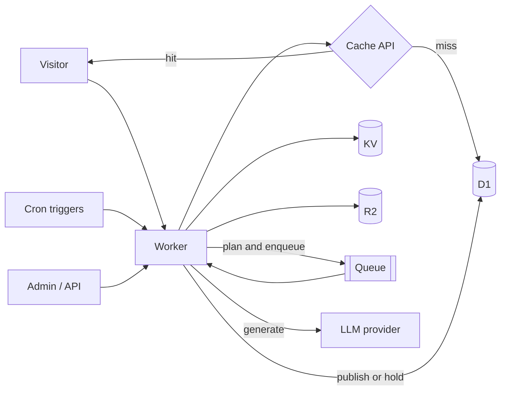

# Architecture

Edge Magazine is a single Cloudflare Worker (Hono, server-rendered JSX) backed by D1, KV and R2. The same Worker serves readers, runs the admin panel, accepts publish API calls and handles cron and queue events. This page describes the stable shape of the system, not individual files.

## Components

| Piece | Used for |
| --- | --- |
| Worker (Hono) | Public pages, `/admin`, `/api`, `scheduled()` and queue consumer |
| D1 | All content and operational data (posts, queue, runs, LLM calls) |
| KV (`CACHE_KV`) | Pre-rendered XML/feeds, runtime config, circuit breaker state, small caches |
| R2 (`UPLOADS`) | Cover images and uploads, served under `/uploads/*` |
| Queue | Background generation jobs, one item per message |
| Workers AI | Default LLM provider, no API key |
| Cron triggers | Daily generation, top-up, heartbeat |

Bindings are declared in `wrangler.toml` without IDs. Wrangler provisions the resources in your account on first deploy.

## Read plane

Everything a visitor touches is a GET handled by the Worker:

- Home, category, article, tag, author, cluster, search, about, legal and newsletter pages.
- `feed.xml`, `robots.txt` and the sitemap family (posts, categories, clusters, tags, authors, pages, news).
- `/uploads/*`, streamed from R2.

Pages are rendered from D1 and wrapped in the edge cache (see below). Static assets in `public/` are served directly by the assets binding before the Worker runs. Search uses an SQLite FTS5 table in D1, rebuilt through the `/api/reindex` endpoint.

## Write plane

Content enters the database in three ways, all ending in the same publish function:

1. The generation pipeline (cron, queue or admin "run now"). See [pipeline.md](pipeline.md).
2. `POST /api/publish` with a bearer `PUBLISH_TOKEN`, for external tools.
3. Manual edits in `/admin`.

Publishing writes the post and its tags, updates the FTS index, purges the affected cache keys and, if configured, pings IndexNow. Other authenticated API routes: `/api/run`, `/api/drain`, `/api/health`, `/api/indexnow`, `/api/backfill-seo`, `/api/reindex`. All are rate limited per IP.

The admin panel uses a signed session cookie (`SESSION_SECRET`) and CSRF tokens. If `ADMIN_PASSWORD_HASH` is empty, `/admin` returns 503.

## Data model

Content tables: `authors`, `categories`, `tags`, `tag_redirects`, `posts`, `posts_tags`, `topic_clusters`, `topic_cluster_spokes`, `subscribers`.

Pipeline tables:

| Table | Purpose |
| --- | --- |
| `content_queue` | One row per planned article. Status: pending, generating, awaiting_review, published, failed, skipped |
| `pipeline_runs` | One row per run (trigger: cron, manual, backfill) with counts and status |
| `pipeline_ideas` | Every proposed idea and what happened to it: enqueued, dup, safety_blocked, unused |
| `llm_calls` | One row per provider attempt: stage, model, tokens, latency, cost |
| `config_audit` | Diff of every runtime config change, with actor |
| `notifications` | In-app copy of each alert |

Posts keep both the raw body and a sanitized `processed_html` that is what readers see. Structured data (JSON-LD) is stored on the row.

Runtime configuration is one JSON document in KV (`cfg:v1`), deep-merged over code defaults and edited from `/admin`. It holds cadence, budgets, kill switch, publish mode and provider order. Secrets never go there.

## Caching

Two layers, both populated lazily:

- **Cache API (per data center).** Full rendered HTML responses keyed by URL plus a version number. TTLs range from 5 minutes (search) to 24 hours (static pages). Because this cache has no global purge, publishing deletes the affected URLs from the local data center only, and other locations expire by TTL. A deploy that changes shared page chrome should bump the cache version constant to orphan old entries.
- **KV (global).** Pre-rendered payloads that do not depend on the request, such as sitemaps and the RSS feed, with TTLs from 30 minutes to 24 hours. KV deletes on publish are authoritative worldwide.

Static files are cached by the assets layer. Expect new posts to appear on the home page within the page TTL in other regions.

## Cron and queue flow

Three cron triggers are declared in `wrangler.toml`, and `scheduled()` branches on the cron expression:

- Daily generation (01:00 UTC).
- Top-up (08:00 UTC): fills the gap only if fewer than `postsPerDay` posts went out.
- Heartbeat (13:30 UTC): health digest to the configured alert channels.

Content crons do nothing while `pipeline.enabled` is false. When enabled, the daily run reclaims stuck items, ideates topics, enqueues them, and sends one queue message per pending item (up to `postsPerDay`). The queue consumer, with concurrency 1, runs the generation stages for that single item. A queue consumer gets a larger time budget than a request, which is why generation does not run inline. If the queue binding is missing (for example in local dev), the code falls back to an inline batch limited by `pipeline.timeBudgetMs`.

## Observability

Structured JSON logs are enabled (`[observability]`) and visible in the dashboard or `wrangler tail`. Run history, per-call LLM cost and alerts are in `/admin`.
